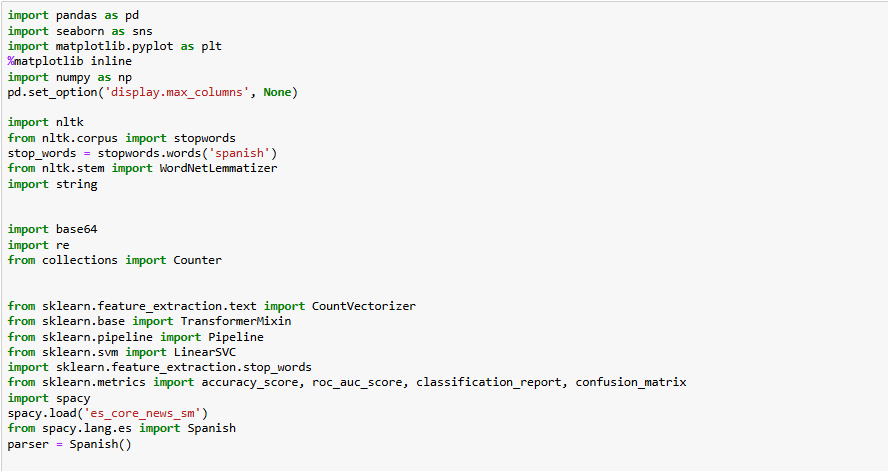
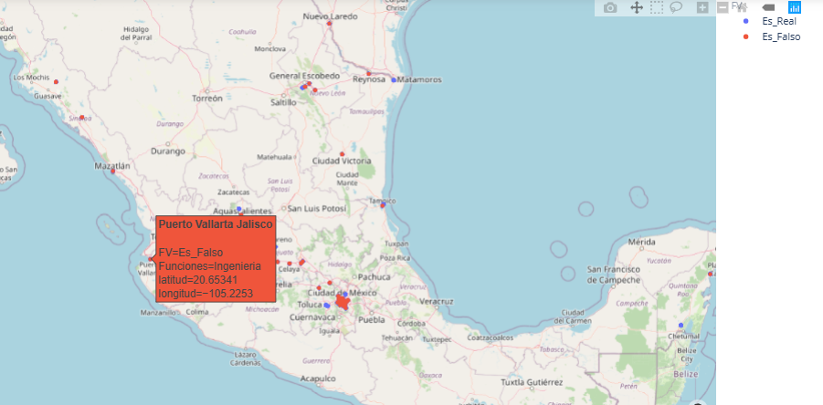
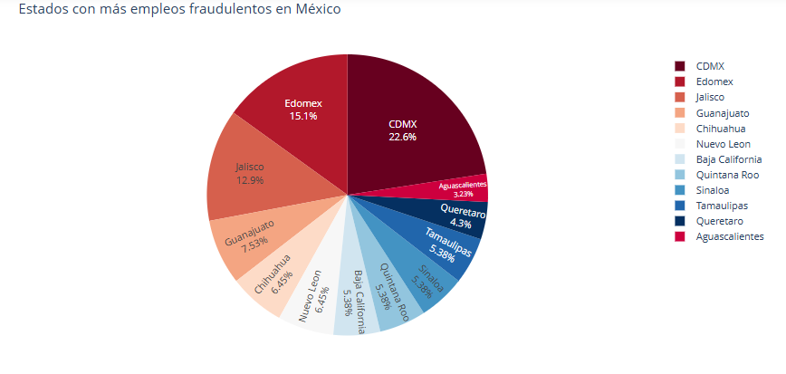
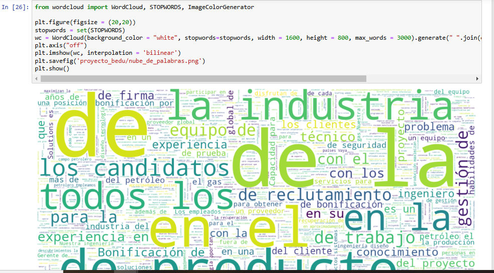

# FakeJobsAnalyzer
In this notebook, a previously handled dataset was used with ETL techniques to model and explore the collected jobs data in Mexico. Subsequently, applying filtering and enrichment methods to add location using Google Maps API to generate a visual report.  The Natural Language Processing (NLP) library was implemented to standardize the values. 

For this project a set of libraries for data analysis was used including Pandas, GeoPandas, Numpy, NLTK, Searborn, matplotlib and sklearn. As a result, the discriminated data led to a map for visualization with positive and negative values (Real Jobs vs Fake Jobs) location in Mexico. 

  
__Some Libraries implemented.__ 

 

  
__Map of Mexico where there were more fake jobs at the time of the analysis.__

 

  
__States of Mexico where there were more fake jobs detected.__

 

  
__The main library to carry on this project: NLTK.__

  
  
